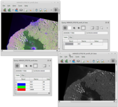
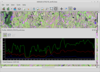
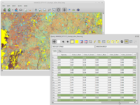
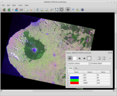
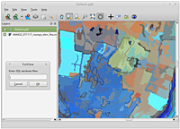

# TuiView


A PyQt-based lightweight Raster GIS

|  |  |  |
|  |  |  |

TuiView is a lightweight raster GIS with powerful raster attribute table manipulation abilities. Features of TuiView include:

- "Geo-linking" - 2 or more windows linked so they move and zoom together
- Querying and plotting of raster values
- Overlaying and querying of vector layers
- Ability to stretch data for viewing in a number of ways, and ability to set a default stretch for each type of file
- Saving and loading of stretch information into text or image files
- Profile tool
- Display of raster attribute tables and highlighting of rows for queried pixel
- Selection of raster attribute table rows based on a query, or through geographical selection
- Creation of new attribute table columns and updating of columns
- Flicker tool

Major development work on this project has been funded by [Landcare Research](https://www.landcareresearch.co.nz). 

## Download

### Binaries

Once you have installed [Conda Forge](https://github.com/conda-forge/miniforge), run the following commands on the command line to install TuiView from the "conda-forge" channel:

```bash
conda create -n myenv tuiview
conda activate myenv
```

### Source

TuiView requires: Python > 3.5, Numpy, GDAL and PyQt.
Download releases through git at [GitHub](https://github.com/ubarsc/tuiview).

## Documentation

User Documentation is available in the [TuiView wiki](https://github.com/ubarsc/tuiview/wiki).

There is also [Developer's Documentation](https://tuiview.readthedocs.io/en/latest/) available.
